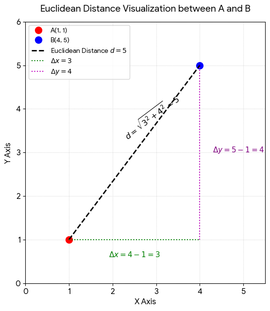
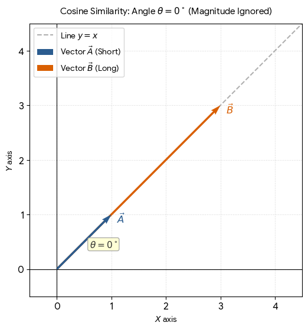
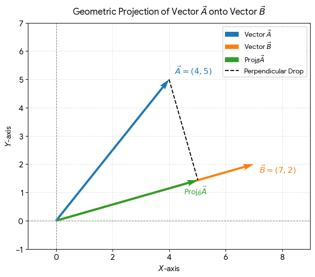

# FAISS

> what is FAISS - It is a Similarity search approach .

A FAISS index is a specialized data structure in the FAISS (Facebook AI Similarity Search) library used to store and organize high-dimensional vectors so you can search through them quickly.

### How a FAISS Index Works
- **Storage**: It holds your database vectors in memory (RAM or GPU).
- **Organization**: It arranges vectors using a specific strategy, such as grouping similar vectors into clusters or compressing them to save space.
- **Querying**: When given a new query vector, it scans only the most relevant parts of the data to return the closest matching neighbors instantly.

## Types of FAISS

- [video](https://www.youtube.com/watch?v=B7wmo_NImgM)
    - [more details](https://www.youtube.com/watch?v=1ZTvuWMb_f8)

#### Common Types of FAISS Indexes

Different index types balance trade-offs between speed, memory usage, and accuracy:

- **Flat Index (IndexFlatL2 / IndexFlatIP)**: Performs an exact, brute-force search by comparing the query against every vector. It is 100% accurate but slow for large datasets.

- **Inverted File Index (IndexIVFFlat)**: Divides the vector space into smaller clusters. During a search, it looks only inside the closest clusters, making it much faster for big datasets.

- **Hierarchical Navigable Small World (IndexHNSW)**: Uses a multi-layer graph structure for ultra-fast and accurate approximate nearest neighbor searches.

- **Product Quantization (IndexPQ)**: Compresses vectors to drastically reduce memory usage, allowing you to store and search billions of vectors.

## FAISS Additional

-[Mastering Vector Databases: Embeddings, FAISS, and Semantic Search](https://www.youtube.com/watch?v=tQkQCYG8dyE)
    - if you understand the use cases of embeddings and vectors then start the video from `27:00` - Embeddings, FAISS, and Semantic Search
    - if you want to understand the need of vectors , seraching on vectors and basics , then see from starting

- [Implementing a document search using FAISS](https://www.youtube.com/watch?v=ZCSsIkyCZk4)

---

 
 

## Similarity Search Metrices 

### Euclidean Distance ($(L2)$)

This metric measures the **straight-line distance** between two points in space. It focuses purely on **magnitude and position**.

📐 **Formula**

For two 2D points \(A(x_1, y_1)\) and \(B(x_2, y_2)\):
$$
(d=\sqrt{(x_{2}-x_{1})^{2}+(y_{2}-y_{1})^{2}})
$$

💡 **Example**

Imagine two shoppers, Alice and Bob.

- Alice buys 1 apple and 1 banana $(\rightarrow A = [1, 1])$
- Bob buys 4 apples and 5 bananas $(\rightarrow B = [4, 5])$
$$
d=\sqrt{(4-1)^{2}+(5-1)^{2}}=\sqrt{3^{2}+4^{2}}=\sqrt{9+16}=\sqrt{25}=5
$$

- **Result**: The straight-line distance between their shopping habits is 5. A lower number means more similar habits.

 

📊 **Visual Interpretation**

- Visual Key: It represents a literal tape measure pulled straight from point A to point B.

### Cosine Similarity

This metric measures the angle (\(\theta \)) between two vectors. It completely ignores magnitude (scale) and only looks at the direction.

📐 **Formula**

$$
(\text{Similarity}=\cos (\theta )=\frac{A\cdot B}{\|{}A\|{}\|{}B\|{}}
$$

- Outputs range from -1 to 1 (1 means identical direction, 0 means perpendicular).

💡 **Example**

Imagine comparing the preference ratio of fruits.
- Alice buys 1 apple and 1 banana \(\rightarrow A = [1, 1]\)
- Bob buys 100 apples and 100 bananas \(\rightarrow B = [100, 100]\)

Even though Bob bought way more, their ratio is exactly the same (1:1).

- The angle $(\theta )$ between them is $(0^{\circ })$.
- $\cos(0^\circ) = 1$.
- **Result**: Their Cosine Similarity is 1 (perfectly identical taste), even though their Euclidean distance would be massive.

 

📊 **Visual Interpretation**

- Visual Key: It treats vectors like arrows pointing from the origin \((0,0)\). It measures how much the arrows point in the same direction, ignoring how long the arrows are.

### Dot Product (Inner Product)

This metric combines both angle and magnitude. It multiplies the components and adds them up. It is highest when vectors point in the same direction and are long.

📐 **Formula**

$$
A\cdot B=(x_{1}\cdot x_{2})+(y_{1}\cdot y_{2})
$$

💡 **Example**

Let us look at streaming preferences (Action movies, Comedy movies).

- User A watches 1 Action and 2 Comedies $\rightarrow A = [1, 2]$
- User B watches 3 Action and 4 Comedies $\rightarrow B = [3, 4]$

$$
\text{Dot\ Product}=(1\cdot 3)+(2\cdot 4)=3+8=11
$$

- **Result**: The score is 11. If User B watched 40 Action and 50 Comedies, the score would skyrocket, reflecting both shared taste and high engagement.

 

📊 **Visual Interpretation**

- Visual Key: It is geometrically equivalent to projecting Vector A down onto Vector B, and then multiplying the length of that projection by the total length of Vector B.